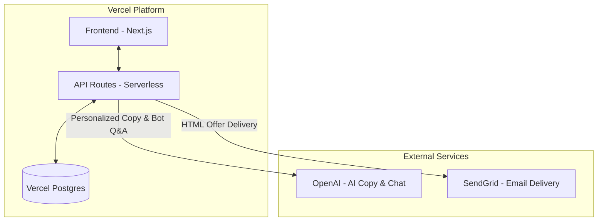

# UpRez - AI-Powered Vacation Rental Upsell Platform

**Status**: Vercel-Ready Monorepo 🚀  
**Target**: Berlin AI Hackathon (Arbio Track)

## Overview

UpRez is an AI-powered upgrade engine for vacation rentals that:
- **Detects Upsell Opportunities**: Automated triggers for pre-arrival and cancellations.
- **Personalized Offers**: Generates high-fidelity fit scores and property comparisons.
- **AI Copywriting**: Crafts personalized email and landing page copy via OpenAI.
- **Interactive AI Concierge**: Real-time Q&A bot for guests to ask about upgrade features.
- **Conversion-Ready**: Integrated email delivery (SendGrid) and dynamic landing pages.

## Tech Stack

- **Framework**: Next.js 15 (TypeScript) - Monorepo (UI + API)
- **Database**: Vercel Postgres (Powered by Neon)
- **Generative AI**: OpenAI GPT-4o-mini
- **Email**: SendGrid API
- **Deployment**: Vercel (Frontend & Serverless Functions)

## System Architecture

UpRez is built as a unified Next.js monorepo, making it extremely easy to deploy and maintain on Vercel.



## Quick Start (Local Development)

### Prerequisites

- Node.js (v20+)
- **SendGrid API Key** (with verified sender)
- **OpenAI API Key**
- A Postgres database (Local or Vercel Postgres)

### Setup

1. **Clone and Configure**:
   ```bash
   cp .env.example .env
   # Edit .env with your API keys and Postgres URL
   ```

2. **Install Dependencies**:
   ```bash
   cd frontend
   npm install
   ```

3. **Initialize Database**:
   Once the server is running, visit `/api/demo/reset` to seed the initial properties and bookings.
   ```bash
   npm run dev
   ```
   Access the Demo Center at `http://localhost:3030/demo`.

## Deployment

UpRez is optimized for **Vercel**. For detailed infrastructure provisioning (Postgres, Secrets, etc.), see [DEPLOYMENT.md](./DEPLOYMENT.md).

## Project Structure

```
up-rez/
├── frontend/                   # Next.js Application (Monorepo)
│   ├── app/                    # Pages & API Routes
│   │   ├── api/                # Backend Logic (Python logic ported here)
│   │   ├── demo/               # Demo Dashboard
│   │   └── offer/[id]/         # Personalized Landing Pages
│   ├── components/             # UI Components
│   ├── lib/                    # Shared Utilities
│   │   ├── db.ts               # Database Layer (Vercel Postgres)
│   │   └── services/           # Ported Business Logic (Offer, Email, RAG)
│   ├── types/                  # TypeScript Interfaces
│   └── scripts/                # Data Scripts
├── initial_data/               # Reference Specs & Specs
└── docker-compose.yml          # Container config for local dev
```

## License

MIT
