# UpRez - AI-Powered Vacation Rental Upsell Platform

**Status**: Vercel-Ready Monorepo 🚀  
**Target**: Berlin AI Hackathon (Arbio Track)

## Overview

UpRez is an AI-powered upgrade engine for vacation rentals that:
- **Detects Upsell Opportunities**: Automated triggers for pre-arrival and cancellations.
- **Personalized Offers**: Generates high-fidelity fit scores and property comparisons.
- **AI Copywriting**: Crafts personalized email and landing page copy via OpenAI.
- **Interactive AI Concierge**: Real-time Q&A bot for guests to ask about upgrade features.
- **Conversion-Ready**: Integrated email delivery (SendGrid) and dynamic landing pages.

## Tech Stack

- **Framework**: Next.js 15 (TypeScript) - Monorepo (UI + API)
- **Database**: Vercel Postgres (Powered by Neon)
- **Generative AI**: OpenAI GPT-4o-mini
- **Email**: SendGrid API
- **Deployment**: Vercel (Frontend & Serverless Functions)

## System Architecture

UpRez is built as a unified Next.js monorepo, making it extremely easy to deploy and maintain on Vercel.


## UI Flow Diagram

### Guest Journey

```mermaid
graph TD
    Start([Guest Books Standard Room]) --> Trigger{Trigger Event}
    
    Trigger -->|7 Days Before Arrival| Cron[Cron Job Runs]
    Trigger -->|Premium Room Cancelled| Cancel[Cancellation Detected]
    
    Cron --> Engine[UpRez Engine Analyzes]
    Cancel --> Engine
    
    Engine --> Match{Premium Room<br/>Available?}
    Match -->|No| End1([No Action])
    Match -->|Yes| Generate[Generate Offer]
    
    Generate --> AI[AI Generates Copy]
    AI --> Email[📧 Email Sent]
    
    Email --> Guest[Guest Receives Email]
    Guest --> Click{Guest Clicks<br/>CTA}
    
    Click -->|Ignore| Expire[Offer Expires]
    Click -->|Open| Landing[🎯 Landing Page]
    
    Landing --> Explore{Guest Actions}
    Explore -->|View Details| Details[Property Specs]
    Explore -->|Ask Questions| Chat[💬 AI Concierge Chat]
    Explore -->|Compare Options| Switch[Switch Property]
    Explore -->|Accept| Payment[💳 Payment Page]
    
    Details --> Explore
    Chat --> Explore
    Switch --> Landing
    
    Payment --> Confirm[✅ Confirmation Page]
    Confirm --> AutoExpire[Other Offers<br/>Auto-Expired]
    AutoExpire --> End2([Booking Updated])
    
    Expire --> End3([Offer Closed])
    
    style Email fill:#e3f2fd
    style Landing fill:#fff3e0
    style Chat fill:#f3e5f5
    style Payment fill:#e8f5e9
    style Confirm fill:#c8e6c9
```



### Host Dashboard Flow

```mermaid
graph TD
    Host([Host/PM Login]) --> Dashboard[📊 Demo Dashboard]
    
    Dashboard --> View{Choose Action}
    
    View -->|Monitor| Stats[View Stats Card]
    View -->|Review| Offers[📋 Offers Table]
    View -->|Manage| Settings[⚙️ Settings]
    View -->|Test| Trigger[🚀 Trigger Offer]
    
    Stats --> Metrics[Revenue Lift<br/>Conversion Rate<br/>Active Offers]
    
    Offers --> OfferActions{Offer Actions}
    OfferActions -->|Preview| EmailPrev[📧 Email Preview]
    OfferActions -->|View| PublicPage[🔗 Public Landing Page]
    OfferActions -->|Cancel| ExpireOffer[🚫 Expire Offer]
    
    Settings --> AIConfig[AI Copy Settings]
    Settings --> EmailConfig[Email Templates]
    Settings --> HostInfo[Host Information]
    
    Trigger --> SelectBooking[Select Booking]
    SelectBooking --> TriggerType{Trigger Type}
    TriggerType -->|Cron| CronTrigger[Simulate 7-Day Check]
    TriggerType -->|Cancellation| CancelTrigger[Simulate Cancellation]
    
    CronTrigger --> OfferGen[Offer Generated]
    CancelTrigger --> OfferGen
    OfferGen --> Notification[✅ Success Notification]
    
    EmailPrev --> Dashboard
    PublicPage --> Dashboard
    ExpireOffer --> Refresh[Refresh Table]
    Refresh --> Offers
    
    style Dashboard fill:#e3f2fd
    style Offers fill:#fff3e0
    style Settings fill:#f3e5f5
    style OfferGen fill:#c8e6c9
```



### Data Flow: Offer Generation

```mermaid
sequenceDiagram
    participant Cron as Cron Job
    participant API as API Route
    participant DB as Database
    participant AI as OpenAI
    participant Email as SendGrid
    participant Guest as Guest Email

    Cron->>API: POST /api/demo/trigger
    API->>DB: Fetch eligible bookings
    DB-->>API: Booking data
    
    API->>DB: Find available upgrades
    DB-->>API: Premium properties
    
    API->>API: Calculate fit scores
    API->>API: Rank top 3 options
    
    API->>AI: Generate personalized copy
    AI-->>API: Headline, summary, features
    
    API->>DB: Save offer record
    DB-->>API: Offer ID
    
    API->>Email: Send HTML email
    Email-->>Guest: 📧 Upgrade invitation
    
    API-->>Cron: ✅ Success response
```




## Quick Start (Local Development)

### Prerequisites

- Node.js (v20+) or **Docker**
- **SendGrid API Key** (with verified sender)
- **OpenAI API Key**
- A Postgres database (Local or Vercel Postgres)

### Docker Flow (Recommended)

1. **Launch Stack**:
   ```bash
   docker-compose up -d
   ```

2. **Replicate Vercel Build (Inside Docker)**:
   To ensure your code passes Vercel's strict production checks (TypeScript, Route verification), run:
   ```bash
   docker-compose exec frontend npm run build
   ```

3. **Reset/Seed Data**:
   Visit `http://localhost:3030/api/demo/reset` or run:
   ```bash
   docker-compose exec frontend curl http://localhost:3030/api/demo/reset -X POST
   ```

## Quick Start

### 1. Configure Environment
Regardless of your setup, you need to configure your API keys:
```bash
cp .env.example .env
# Edit .env with your OpenAI, SendGrid, and Postgres credentials
```

---

### Option A: Docker (Recommended) 🐳
Best for a consistent environment. Docker handles Node.js, Dependencies, and the Dev Server automatically.

1. **Start the Platform**:
   ```bash
   docker-compose up -d
   ```

2. **Use the CLI Helper**:
   We've provided a simple script to run common tasks inside the container:
   - **Seed/Reset Data**: `./uprez.sh reset`
   - **Production Build Check**: `./uprez.sh build`
   - **Follow Logs**: `./uprez.sh logs`
   - **Shell Access**: `./uprez.sh shell`

3. **Launch**: Open [http://localhost:3030/demo](http://localhost:3030/demo)

---

### Option B: Manual (Host machine)
Use this if you prefer running Node.js directly on your machine.

1. **Install Dependencies**:
   ```bash
   cd frontend && npm install
   ```
2. **Start Dev Server**:
   ```bash
   npm run dev
   ```
3. **Seed Database**:
   Visit [http://localhost:3030/api/demo/reset](http://localhost:3030/api/demo/reset) to initialize data.

---

## Deployment

UpRez is optimized for **Vercel**. For detailed infrastructure provisioning (Postgres, Secrets, etc.), see [DEPLOYMENT.md](./DEPLOYMENT.md).

## Project Structure

```
up-rez/
├── frontend/                   # Next.js Application (Monorepo)
│   ├── app/                    # Pages & API Routes
│   │   ├── api/                # Backend Logic (Python logic ported here)
│   │   ├── demo/               # Demo Dashboard
│   │   └── offer/[id]/         # Personalized Landing Pages
│   ├── components/             # UI Components
│   ├── lib/                    # Shared Utilities
│   │   ├── db.ts               # Database Layer (Vercel Postgres)
│   │   └── services/           # Ported Business Logic (Offer, Email, RAG)
│   ├── types/                  # TypeScript Interfaces
│   └── scripts/                # Data Scripts
├── initial_data/               # Reference Specs & Specs
└── docker-compose.yml          # Container config for local dev
```

## Core AI Logic & Prompting

The AI behavior of UpRez is consolidated into specific service layers for easy auditing and refinement of prompts:

- **Offer Copywriting**: Found in `frontend/lib/services/offerService.ts`. Look for the `generateAICopy` function. This prompt handles the transformation of property delta (e.g., "more beds") into high-converting sales copy.
- **AI Concierge (RAG)**: Found in `frontend/lib/services/ragService.ts`. Look for the `queryRag` function. This prompt uses a Retrieval-Augmented Generation approach to answer guest questions using property-specific knowledge.
- **Companion Bot**: Found in `frontend/app/api/chat/route.ts`. This contains the system prompt for the real-time guest companion that manages interactions on the landing pages.

## License

MIT
